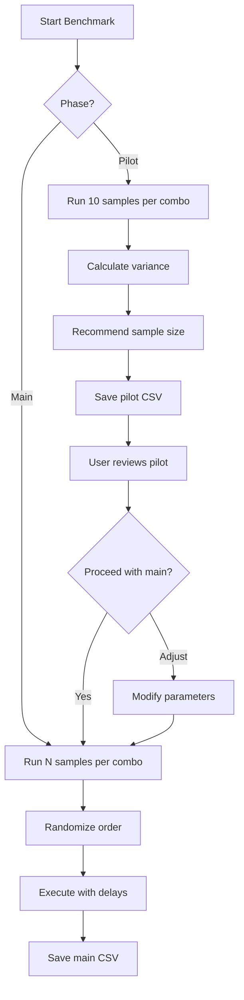

# Payment Facilitator Benchmark Plan

## Overview

This plan outlines a statistically sound approach to compare payment settlement times across three facilitators:
- **FareSide** (`https://fareside.com/` endpoint)
- **PayAI** (`https://facilitator.payai.network`)
- **Coinbase** (official x402 facilitator)

On the **Base** network (EVM, eip155:8453) - $0.10 per transaction

> **Note**: Solana mainnet support can be added later if needed.

## Metrics Collected

Each benchmark run captures two timing metrics:

1. **Facilitation Time** (`elapsed`): Time spent on the server side for the facilitator to settle the payment (measured inside the middleware)
2. **Roundtrip Time**: Total client-side time including network latency, payment processing, and response

## Statistical Approach

### Phase 1: Pilot Run (10 samples per facilitator)

**Purpose**: Estimate variance to calculate required sample size for the main study.

**Configuration**:
- 10 samples per facilitator × 3 facilitators = 30 total requests
- Estimated cost: $3.00

**Output**: Pilot CSV with variance estimates

### Phase 2: Sample Size Calculation

Using the pilot data, calculate the required sample size using the formula for comparing two means:

```
n = 2 * ((z_α/2 + z_β)² * σ²) / δ²
```

Where:
- `z_α/2` = 1.96 for 95% confidence level
- `z_β` = 0.84 for 80% power
- `σ²` = pooled variance from pilot
- `δ` = minimum detectable difference (e.g., 50ms)

**Rule of thumb**: If pilot shows high variance, we need more samples. Typical ranges:
- Low variance (CV < 20%): 30-50 samples sufficient
- Medium variance (CV 20-50%): 50-100 samples recommended
- High variance (CV > 50%): 100+ samples needed

### Phase 3: Main Benchmark Run

Execute the calculated number of samples with:
- Randomized order to avoid systematic bias
- Delays between requests to avoid rate limiting
- Timestamp recording for time-of-day analysis

## CSV Output Format

```csv
timestamp,facilitator,network,sample_num,facilitation_ms,roundtrip_ms,success,error
2026-01-28T12:00:00.000Z,FareSide,base,1,234,456,true,
2026-01-28T12:00:05.000Z,PayAI,base,1,189,412,true,
2026-01-28T12:00:10.000Z,Coinbase,base,1,201,398,true,
...
```

### Column Definitions

| Column | Type | Description |
|--------|------|-------------|
| `timestamp` | ISO 8601 | When the request was initiated |
| `facilitator` | string | FareSide, PayAI, or Coinbase |
| `network` | string | base or solana-mainnet |
| `sample_num` | integer | Sample number within this facilitator/network combo |
| `facilitation_ms` | integer | Server-side facilitation time in milliseconds |
| `roundtrip_ms` | integer | Total client roundtrip time in milliseconds |
| `success` | boolean | Whether the request succeeded |
| `error` | string | Error message if failed |

## Benchmark Script Architecture



## Analysis Recommendations

After collecting data, perform these analyses:

### 1. Descriptive Statistics
- Mean, median, standard deviation for each facilitator/network
- Box plots to visualize distributions
- Identify outliers (> 3 standard deviations)

### 2. Statistical Tests

**For comparing facilitators within same network**:
- ANOVA if data is normally distributed
- Kruskal-Wallis test if non-normal

**For pairwise comparisons**:
- Tukey HSD post-hoc test (after ANOVA)
- Mann-Whitney U test (non-parametric)

### 3. Confidence Intervals
- 95% CI for mean facilitation time per facilitator
- Overlap analysis to determine practical significance

### 4. Time-of-Day Effects
- Group by hour and check for patterns
- Consider if certain times show higher variance

## Implementation Files

The following scripts have been created:

1. **[`src/scripts/benchmark-pilot.ts`](../src/scripts/benchmark-pilot.ts)** - Runs the pilot study (10 samples per facilitator)
2. **[`src/scripts/benchmark-main.ts`](../src/scripts/benchmark-main.ts)** - Runs the main study with configurable sample size
3. **[`src/scripts/analyze-benchmark.ts`](../src/scripts/analyze-benchmark.ts)** - Analyzes CSV data and provides statistical comparisons

## NPM Scripts

```bash
# Run pilot study (10 samples per facilitator, ~$3.00)
npm run bench:pilot

# Run main study with N samples (default: 50)
npm run bench:main
npm run bench:main 100  # for 100 samples

# Analyze benchmark results
npm run bench:analyze benchmark-pilot-2026-01-28.csv
```

## Cost Estimates (Base Network Only)

| Phase | Samples | Cost |
|-------|---------|------|
| Pilot | 30 | $3.00 |
| Main (n=50) | 150 | $15.00 |
| Main (n=100) | 300 | $30.00 |

## Next Steps

1. ✅ Plan created and approved
2. ✅ Benchmark scripts implemented
3. Run pilot study: `npm run bench:pilot`
4. Analyze pilot results: `npm run bench:analyze <csv-file>`
5. Determine final sample size based on variance
6. Run main study: `npm run bench:main <N>`
7. Analyze results and draw conclusions
